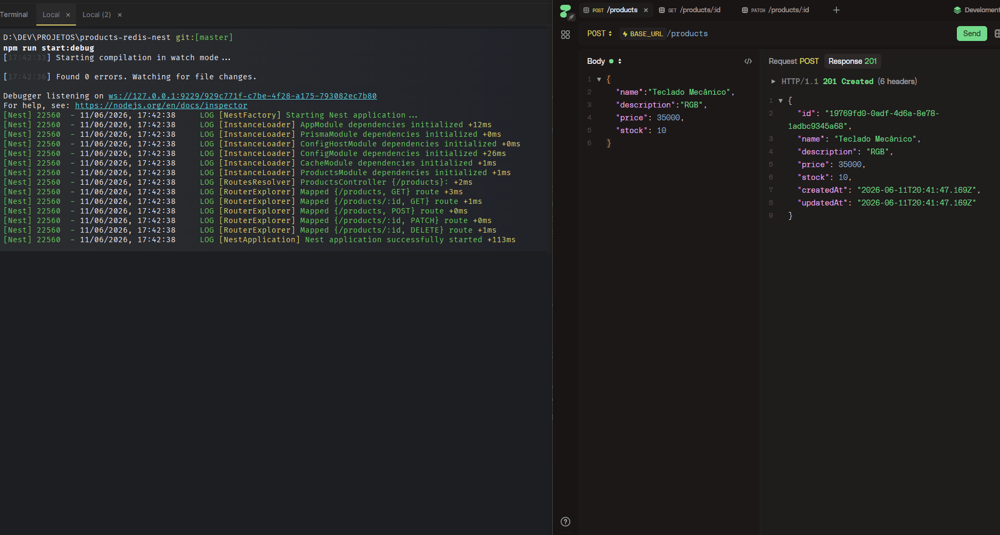

# 🛍️ API de Produtos — NestJS + PostgreSQL + Prisma + Redis

API REST com persistência em PostgreSQL (via Prisma ORM 7) e camada de cache em
Redis. Demonstra arquitetura em camadas, padrão cache-aside e invalidação de cache.

## 🏗️ Arquitetura

```
Cliente → Controller → Service ─┬─ Redis (cache, leitura rápida)
                                └─ Prisma → PostgreSQL (fonte da verdade)
```

- **Leitura** (`GET /products/:id`): tenta o Redis primeiro; só vai ao Postgres no
  cache MISS, e então cacheia o resultado.
- **Escrita** (`POST`/`PATCH`/`DELETE`): grava no Postgres e invalida o cache.

## 🎬 Demonstração



Na primeira requisição o dado vem do PostgreSQL (cache MISS, ~18ms). Na segunda,
vem direto do Redis (cache HIT, ~1ms) — uma boa redução no tempo de
resposta. Ao atualizar o produto, o cache é invalidado e a próxima leitura volta
a buscar no banco.

## 🛠️ Tecnologias
- NestJS + TypeScript
- PostgreSQL + Prisma ORM (v7)
- Redis (@nestjs/cache-manager + @keyv/redis)
- Docker / Docker Compose

## ✅ Pré-requisitos
- Node.js 20 LTS+
- Docker e Docker Compose

## 🚀 Como rodar

```bash
# 1. Sobe PostgreSQL + Redis
docker compose up -d

# 2. Instala dependências
#    (--legacy-peer-deps resolve um conflito conhecido de peer dependency
#     entre o keyv usado pelo ESLint e o exigido pelo @keyv/redis)
npm install --legacy-peer-deps

# 3. Prisma — no Prisma 7 são DOIS comandos separados:
npx prisma migrate dev --name init   # cria e aplica a migration (banco)
npx prisma generate                   # gera o client em src/generated/prisma (código)

# 4. Sobe a aplicação
npm run start:dev
```

> **Observação (Prisma 7):** sempre que alterar o `prisma/schema.prisma` durante o
> desenvolvimento, rode `npx prisma generate` novamente para o client refletir as
> mudanças. O `migrate dev` não faz isso automaticamente nesta versão.

## 🧪 Testando

```bash
# Criar um produto (price em centavos: 35000 = R$ 350,00)
curl -X POST http://localhost:3000/products \
  -H "Content-Type: application/json" \
  -d '{"name":"Teclado Mecânico","description":"RGB","price":35000,"stock":10}'

# Ler duas vezes: 1ª = CACHE MISS (vai ao banco), 2ª = CACHE HIT (vem do Redis)
curl http://localhost:3000/products/<id>
curl http://localhost:3000/products/<id>

# Atualizar (invalida o cache) e ler de novo (MISS com o dado novo)
curl -X PATCH http://localhost:3000/products/<id> \
  -H "Content-Type: application/json" -d '{"price":29900}'
curl http://localhost:3000/products/<id>
```

Inspecionar as duas pontas:

```bash
# PostgreSQL (a fonte da verdade)
docker exec -it postgres psql -U admin -d produtos -c 'SELECT id, name, price FROM "Product";'

# Redis (o cache)
docker exec -it redis redis-cli
KEYS *
TTL "<chave>"
```

Visualizar o banco em interface gráfica: `npx prisma studio`

## 📌 Versões testadas
- Prisma 7.8 · Node 20 · PostgreSQL 16 · Redis 7

## 📚 Conceitos demonstrados
- ORM type-safe com Prisma e migrations versionadas
- Cache-aside e invalidação de cache nas escritas
- Arquitetura em camadas (controller → service → repository)
- Ciclo de vida da conexão (OnModuleInit / OnModuleDestroy)